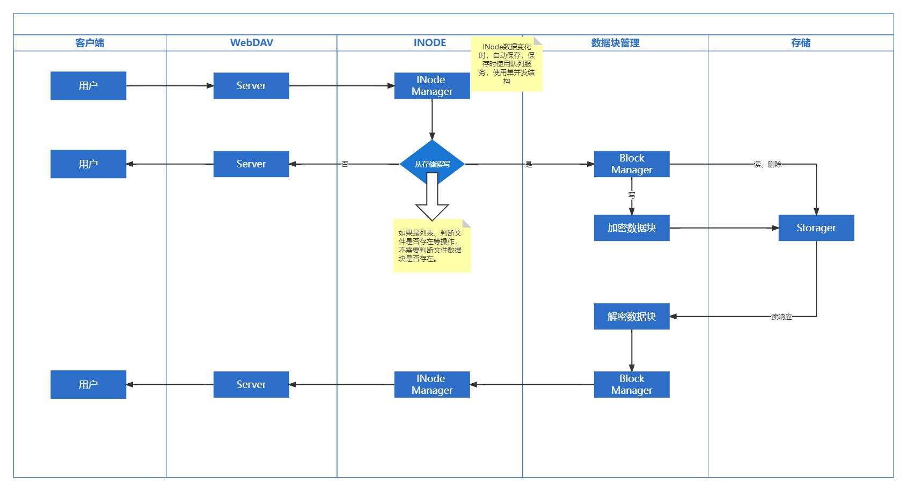

**雾盘**是一个免费开源的网络存储管理系统，它通过将第三方提供的存储功能模拟成块存储设备，以WEBDAV的方式向外提供存储能力，可以使用支持WEBDAV的客户端对数据进行管理。在雾盘的后端，可以对分块的数据进行加密、副本、随机等方式进行存储，保证存储数据的安全。

> 本项目不以存储速度为优先考虑项。

系统目前支持的存储如下：

* [x] 本地存储
* [x] Github
* [x] Gitee
* [ ] 百度网盘
* [ ] 腾讯云COS
* [x] 阿里云OSS
* [x] 夸克网盘

数据流向如下：



# 安装

## 运行环境

系统使用```typescript```进行开发，你需要先安装```nodejs```。

## 安装

### 服务器安装

> 在服务器上，可以直接克隆本项目到本地进行安装。

1. 克隆

```shell
git clone https://github.com/zsea/zFog.git ./
```

2. 安装依赖项

```shell
npm install
```

3. 编译

```shell
npm run build
```

4. 运行

```shell
npm start
```

### Vercel安装

Vercel上可以直接运行```typescript```的项目，你可以直接Fork本项目到你的仓库，然后通过Vercel的部署功能进行部署即可。

> 项目中```vercel.json```为vercel环境的配置文件。

你也可以尝试使用一键部署按钮。


### heroku安装

同样的，你需要Fork本项目到你的仓库，然后通过heroku的部署功能进部署。

你也可以尝试使用一键部署按钮。


### 其它方式部署

暂无

# 配置

> 在运行之前，你需要首先对系统进行配置，如果没有配置项，系统将会启动失败。

## 环境变量配置

系统的配置通过环境变量进行指定，目前支持的环境变量如下：

|变量名称|必需|数据类型|默认值|描述|
|---|---|---|---|---|
|FOG_CONFIGURE_TYPE|否|"base64" \| "plain" \| "file"|base64|指定具体配置的方式。|
|FOG_CONFIGURE|否|string| |具体的配置项|


**FOG_CONFIGURE_TYPE**可选值说明：

* base64 - 通过环境变量**FOG_CONFIGURE**读取具体的配置项，其配置值使用了**base64**进行编码。

* plain - 通过环境变量**FOG_CONFIGURE**读取具体的配置项，其配置未使用任何编码，直接通过JSON格式进行提供。
* file - 通过```configure.json```文件提供配置。

## 配置说明

> 具体的配置使用JSON格式。

|配置项|是否必需|数据类型|默认值|描述|
|---|---|---|---|---|
|timeout|否|number|0|WEBDAV服务器处理时的超时时间，0表示不超时。|
|path|是|string|/ |挂载到WEBDAV服务的路径。|
|blockSize|是|number| |文件分块的大小。|
|copies|是|number| |每个分块存储的份数，当小于存储器数量时，最多只能存储存储器数量相同的份数。|
|copyMode|是|"random"\|"cycle"\|"all"| |存储的选择方式。|
|totalSize|否|number|-1|存储空间的总大小，仅用于显示，不对实际存储功能进行限制。|
|crypto|是|crypto[]| |加密器配置，第一个加密器将做为当前的加密器，其它的主要用于读取数据时进行解密。|
|saver|是|saver| |inode数据的存储器。|
|storages|是|storage[]| |实际的数据存储器列表。|
|authentication|否|authentication| |用户认证信息，若不填写，则允许匿名访问。|
|useHost|否|string| |访问WEBDAV实际使用的host值。|
|useProtocol|否|"http"\|"https"| |访问WEBDAV实际使用的协议。|

## 配置项说明

### copyMode

后端存储的选择方式。

* random - 随机选择。
* cycle - 轮询
* all - 每个存储器都需要存储一份数据块。

### crypto

加密器配置，第一个加密器将做为当前的加密器，其它的主要用于读取数据时进行解密。

* type - 加密器的类型，可选值："base64"|"none"|"xor"
    * base64 - 进行base64进行编码
    * none - 不加密
    * xor - 异或加密
        * mode - 加密的密钥，取值范围：[0,255]
* id - 加密器ID，设置后请不要改变，数据块解密时需要使用该值来选择加密器。

### saver

inode数据的存储器。

* type - 存储类型，可选值："gitee"|"github"|"local"|"array"|"memory"|"oss"|"quark"
    * gitee - 使用```gitee```仓库存储inode数据。
        * token - 调用API的token
        * owner - 存储仓库的owner
        * repo - 仓库名称
        * branch - 分支名称。
        * root - 存储的根目录
    * github - 使用```github```仓库存储inode数据。
        * token - 调用API的token
        * owner - 存储仓库的owner
        * repo - 仓库名称
        * branch - 分支名称。
        * root - 存储的根目录    
    * local - 使用本地文件进行存储。
        * path - 本地存储的路径
    * array - 多个saver的集合，每个server都需要存储一份数据。
        * children - saver[]。可用的saver集合。
    * memory - 内存存储，重启服务会丢失数据。
    * oss - 阿里云oss存储。
        * accessKey - 阿里云AccessKey
        * secret - 阿里云访问的Secret
        * host - 阿里云OSS所在区域的访问主机，不包括blucket名称
        * blucket -OSS存储的blucket名称
        * root - 存储的根目录
    * quark - 夸克网盘
        * cookies - 登录账号的cookie
        * root - 根目录的fid值
* from - 将数据块存储器转换为inode数据存储器，此处与数据块存储器配置中的```ref```值相匹配。

### storages

实际的块数据存储器。

* type - 当前支持的存储器类型，可选值："gitee"|"github"|"local"|"null"|"oss"|"quark"
    * null - 不存储数据。
    * local - 使用本地文件夹存储数据。
        * path - 存储数据的本地文件夹。
    * github - 使用github仓库存储数据。
        * token - 调用API的token
        * owner - 存储仓库的owner
        * repo - 仓库名称
        * branch - 分支名称。
        * root - 存储的根目录
    * gitee - 使用gitee仓库存储数据。
        * token - 调用API的token
        * owner - 存储仓库的owner
        * repo - 仓库名称
        * branch - 分支名称。
        * root - 存储的根目录
    * oss - 阿里云oss存储。
        * accessKey - 阿里云AccessKey
        * secret - 阿里云访问的Secret
        * host - 阿里云OSS所在区域的访问主机，不包括blucket名称
        * blucket -OSS存储的blucket名称
        * root - 存储的根目录
    * quark - 夸克网盘
        * cookies - 登录账号的cookie
        * root - 根目录的fid值        
* mode - 存储器权限。0b111，从左到右，第1位：读的权限，第二位：写的权限，第三位：删除的权限。
* ref - 字符串，设置值后，在saver配置中可使用当前值匹配到，要求IStorage必须同时实现ISaver

### authentication

身份认证信息，不配置此项则允许任何人访问。

* type - 身份认证的类型，可选值："basic" | "digest" | "none"
    * none - 不启用身份认证。
    * basic
    * digest
* realm - 选填，用于```basic```与```digest```身份认证。
* users - 账号列表，类型：user[]
    * username - 账号名称
    * password - 密码
    * rights - 用户权限，可空（具有所有权限）。数据类型为：object，对象的键为访问路径，值为指定路径的访问权限，可选值为：'canWrite' | 'canWriteLocks' | 'canWriteContent' | 'canWriteContentTranslated' | 'canWriteContentSource' | 'canWriteProperties' | 'canRead' | 'canReadLocks' | 'canReadContent' | 'canReadContentTranslated' | 'canReadContentSource' | 'canReadProperties'

# 致谢

本项目使用了[npm-WebDAV-Server](https://github.com/OpenMarshal/npm-WebDAV-Server)提供的WEDAV功能，并对该项目的代码进行了部分修改，并重新发布到了```npm```，在此对```npm-WebDAV-Server```的原作者是表示感谢。修改后的代码仓库地址为：[https://github.com/zsea/npm-WebDAV-Server](https://github.com/zsea/npm-WebDAV-Server)。
